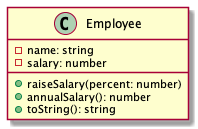

# Employee

Implementáljunk egy munkavállalót reprezentáló osztályt!

# Employee

## constructor(name: string, salary: number)

A `name` a munkavállaló neve, a `salary` a havi fizetése.

Ha `name` nincs megadva, hibát dob.

- `should throw error when name is undefined`

Ha `name` üres, hibát dob.

- `should throw error when name is empty`

Ha `salary` negatív, hibát dob.

- `should throw error when salary is negative`

A `salary` megadása nem kötelező, ilyenkor a fizetést a minimálbér értékével (47000) inicializáljuk.

- `should initialize the salary to the minimum wage when undefined`

## raiseSalary(percent: number): number

Megnöveli a munkavállaló fizetését. A `percent` a fizetésemelés százalékos mértéke.

- `should increase the salary of the employee by the given percent`

Ha `percent` negatív, hibát dob.

- `should throw error when percent is negative`

## annualSalary(): number

Az éves fizetéssel tér vissza.

- `should return the annual salary`

## toString(): string

Az objektum állapotának egy olvasható string reprezentációjával tér vissza.

Példa: `Employee[_name="John Doe",_salary=100000]`

- `should return a string representation of the state`

