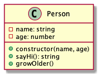

# Person

Tekintsük az alábbi, személyt leíró `Person` osztályt.

A `name` és `age` private propertyk a személy neve és életkora.

## constructor(name: string, age: number)

Ha a `name` nincs megadva, hibát dob.

- `should throw error if name is missing`

Ha a `name` üres, hibát dob.

- `should throw error if name is empty`

Ha az `age` nincs megadva, hibát dob.

- `should throw error if age is missing`

Ha az `age` negatív, hibát dob.

- `should throw error if age is negative`

## age(): number

A személy életkorával tér vissza.

- `should return the age of the person`

## growOlder()

Eggyel növeli az életkort.

- `should increment the person age by one`

## sayHi(): string

Egy rövid bemutatkozó szöveggel tér vissza.

Minta: `"Hi, my name is John Doe and I'm 33 years old."`

- `should return an introduction string`

