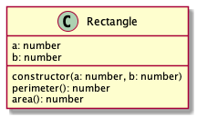

# Rectangle

Írjunk egy `Rectangle` osztályt, amely egy téglalapot reprezentál. A téglalap oldalait az a és b propertyk reprezentálják.

## constructor(a: number, b: number)

Inicializálja a téglalap oldalait. RangeErrort dob, ha az a vagy b paraméterek közül valamelyik kisebb vagy egyenlő nullával.

## perimeter(): number

A téglalap kerületét adja vissza.

## area(): number

A téglalap területét adja vissza.