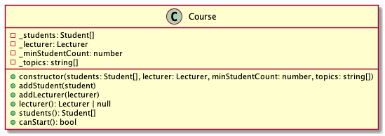

# Courses

Modellezzünk egy kurzust és a hallgatókat.

# Lecturer

A Lecturer osztály egy oktatót ír le. 


Az oktató tudását a `skills` írja le, a tudást most string tömbként képzeljük el, pl `['frontend', 'backend', 'project management']`.

## constructor(skills: string[])

Inicializálja az objektumot.

- `should initialize instance`

Ha a skills nincs megadva, üres tömbbel inicializálja a propertyt.

- `should initialize skills with empty array if parameter is missing`

## skills()

A tapasztalatokat leíró tömbbel tér vissza.

- `should return the lecturer skills`

## matchTopics(topics: string[]): number

Megmondja, hogy a megadott témakörök (`topics`) közül hány darabbal van tapasztalata az oktatónak.

Példa: 
```js
const lecturer = new Lecturer(['topic1', 'topic2'])

lecturer.matchTopics(['topic1', 'topic2', 'topic3']; // 2
```

- `should return number of how many skills match the provided topics`

# Student


Egy hallgatót ír le. A `skillLevel` hallgató tudásszintje.

## constructor(skillLevel: number)

Inicializálja az objektumot

- `should initialize the instance`

Ha a `skillLevel` nincs megadva, a property értéke üres tömb.

- `should return skill level`

## skillLevel(): number

A hallgató tudásszintjével tér vissza.

- `should return skill level`

# Course



Egy kurzust leíró osztály. 

A kurzushoz több hallgató és egyetlen oktató tartozik.


A kurzus csak akkor tud elindulni, ha elegendő hallgató van és van oktató.


## constructor(students: Student[], lecturer: Lecturer, minStudentCount: number, topics: string[])

Inicializálja az objektumot. Megadhatjuk a kurzus hallgatóit, az oktatót, az indításához szükséges hallgatók számát valamint a kurzus tematikáját.

- `should initialize instance`

Ha a `students` nincs megadva, a property kezdőértéke üres tömb

- `should initialize students to empty array when parameter is missing`

Ha a `lecturer` nincs megadva, a property kezdőértéke `null`.

- `should initialize lecturer to null when parameter is missing`

## addStudent(student: Student)

Hozzáadja a hallgatót a kurzushoz.

- `should add the student to the course`

Ha a hallgató már hozzá van adva, hibát dob. A konkrét hallgató objektum egyezését vizsgáljuk.

- `should throw error if student is already added`

## addLecturer(lecturer: Lecturer)

Hozzáadja az oktatót a kurzushoz.

A hozzáadás feltétele, hogy az oktató a kurzus témaköreinek kétharmadához legyen tapasztalata.

- `should add lecturer to the course when lecturer skills match 2/3 of topics`
- `should not add lecturer to the course when lecturer skills do not match 2/3 of topics`

 Ha már van oktató a kurzushoz, hibát dob.

- `should throw error when course already has a lecturer`

## lecturer(): Lecturer | null

A kurzushoz rendelt oktatóval tér vissza

- `should return the lecturer added to a course`

Ha nincs oktató, a visszatérési érték `null`

- `should return null if no lecturer added to a course`

## students(): Student[]

A hallgatókkal tér vissza.

- `should return the students added to the course`

## canStart(): bool

Igazzal tér vissza, ha a kurzus el tud indulni. 

A kurzus csak akkor tud elindulni, ha elegendő hallgató van és van oktató.

- `should return true if student number is sufficient and lecturer is added`

Ha nincs elég hallgató, hamissal tér vissza.

- `should return false if student number is insufficient`

Ha nincs oktató, hamissal tér vissza

- `should return false if lecturer is not added`