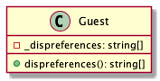
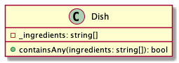
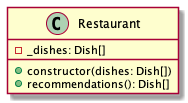
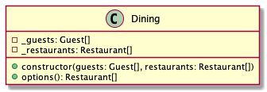

# Dining

Modellezzünk egy étteremben töltendő estét a barátokkal.

Legyen egy `Dish`, `Restaurant`, `Guest` és egy `Dining` osztályunk, amelyek
rendre egy ételt, egy éttermet, egy vendéget és egy vendéglő látogatás
eseményét reprezentálják.

Mindenkinek lehetnek preferenciái, hogy mit nem eszik. 

A feladat az éttermek összegyűjtése, ahol mindenki számára van étkezési lehetőség.

# Guest

Egy vendéget ír le. A vendég egyetlen lényeges tulajdonsága,
hogy milyen összetevőket nem fogyaszt.

Az összetevőket egyszerű stringekkel jelöljük.

## constructor(dispreferences: string[])

Inicializálja az objektumot. A `dispreferences` paraméter a vendég által mellőzött összetevőket tartalmazó tömb. 

## dispreferences(): string[]

A vendég által mellőzött összetevők listájával tér vissza. 

- `should return the list of ingredients the guest wont eat`

# Dish

Egy ételt reprezentál. A `Dish` egyetlen lényeges tulajdonsága az összetevőinek a listája.

## constructor(ingredients: string[])

Inicializálja az objetumot. Az ingredients az étel összetevőit tartalmazó egyszerű string tömb.

## containsAny(ingredients: string[]): bool

Megmondja, hogy az átadott ingredients tömb elemei közül bármelyiket tartalmazza-e az étel.

A `containsAny` segítségével mondható meg, hogy egy adott étel megfelelő-e egy adott vendég összes feltételének, azaz, hogy az étel nem tartalmaz semmit azokból az összetevőkből, amelyeket a vendég nem fogyaszt.

- `should return true if dish contains any of the provided ingredients`
- `should return false if dish does not contains any of the provided ingredients`

# Restaurant

Egy vendéglőt reprezentáló osztály. Egyetlen érdekes tulajdonsága a felszolgált ételek tömbje.

## constructor(dishes: Dish[])

## recommendations(dispreferences: string[]): Dish[]

Azon ételek listájával tér vissza, amelyek nem tartalmazzák a `dispreferences` paraméterben megadott összetevők egyikét sem.

- `should return list of dishes not containing any of the provided ingredients`

# Dining

A vendégül látást reprezentálja. Kapcsolatot teremt a vendégek és az éttermek között. Két lényeges jellemzője a vendégek és az éttermek listája.

## constructor(guests: Guest[], restaurants: Restaurant[])

## options(): Restaurant[]

Azokkal az éttermekkel tér vissza, amelyek minden vendég részére legalább egy étellel tudnak szolgálni a vendég személyes preferenciáinak megfelelően, azaz ahol mindenki tud enni valamit.

- `should return the restaurants where everyone has at least one recommendation`

