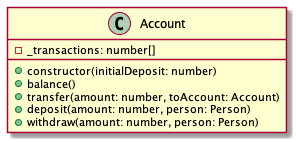
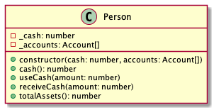

# Banking

Modellezzünk személyi pénzügyeket! Tekintsük az alábbi osztályokat.

# Account

Egy bankszámlát ír le. A számla jellemzője a rajta végrehajtott tranzakciók listája.

Egy tranzakciót egy szám jelöl. A jóváírást pozítív számmal, a leemelést negatív számmal jelöljük. Egy tranzakció vagy jóváírást vagy leemelést kell jelöljön, nem létezik nulla értékű tranzakció.

## constructor(initialDeposit: number)

Az `initialDeposit` a folyószámla létrehozásakor egy esetleges betéti tranzakció értéke. Ha megadtunk egy `initialDeposit` értéket, a számla tranzakció listáján megjelenik a betét.

- `should initialize with a deposit transaction when initialDeposit is provided`

Ha az `initialDeposit` nincs megadva, a tranzakció lista kezdetben üres.

- `should initialize with empty transaction list when initialDeposit is not provided`

Ha az `initialDeposit` nulla, a tranzakció lista kezdetben üres.

- `should initialize with an empty transaction list when initialDeposit is zero`

Ha az `initialDeposit` negatív, hibát dob.

- `should throw error when initialDeposit is negative`

## balance(): number

A számla aktuális egyenlegével tér vissza. Az egyenleg a tranzakciók összege.

- `should return the sum of the transactions`

## deposit(amount: number, person: Person)

Elhelyezi a megadott összeget a számlán.

Az elhelyezés során ha a személynek volt elegendő készpénze, egy betéti tranzakció jön létre a megadott összeggel.

- `should create a deposit transaction`
- `should not create transaction if person does not have enough cash`

Az elhelyezés során, ha a személynek volt elegendő készpénze, az összeg levonódik a személy készpénz állományából.

- `should decrease the person cash by amount`
- `should not modify person cash if person does not have enough cash`

Ha `amount` nem pozitív szám, hibát dob

- `should throw error when amount is not a positive number`

## withdraw(amount: number, person: Person)

Leemeli a megadott összeget a számláról és hozzáadja a személy készpénzéhez, ha van fedezet.

- `should increase person cash if person has enough cash`
- `should not modify person cash if account balance is insufficient`

A leemelés egy `amount` mértékű negatív előjelű tranzakciót hoz létre, ha a számlán van fedezet.

- `should create a withdraw transaction`
- `should not create a withdraw transaction if account balance is insufficient`

Ha az `amount` negatív, hibát dob.

- `should throw error when amount is not a positive number`

## transfer(amount: number, toAccount: Account)

Átvezeti az amount összeget a toAccount számlára to.

Az átvezetés során a küldő számlán létrejön egy leemelési tranzakció, ha a küldő számlán van fedezet.

- `should create a withdraw transaction on the origin account`
- `should not create withdraw transaction when there is not enough money`

Az átvezetés során a fogadó számlán létrejön egy jóváírás tranzakció.

- `should create a deposit transaction on the target account`
- `should not create a deposit transaction when there is not enough money `

Ha `amount` nem pozitív, hibát dob

- `should throw error when amount is not a positive number`

Ha `toAccount` nincs megadva, hibát dob

- `should throw error when toAccount is not provided`

# Person

Egy személyt ír le. Egy személynek készpénze és bankszámlái lehetnek.
A `_cash` nemnegatív szám, az `_accounts` egy bankszámlákat tartalmazó tömb.

## constructor(cash, accounts)

Inicializálja a propertyket.

Ha a cash negatív, hibát dob.

- `should throw error when cash is negative`

Ha a cash nincs megadva, a property kezdőértéke 0. 

- `should initialize _cash with zero when cash is undefined`

Ha az accounts nincs megadva, a property értéke egy üres tömb.

- `should initialize _accounts with empty array if accounts is undefined`

## cash()

A rendelkezésre álló készpénz mennyiségével tér vissza

- `should return the amount of cash`

## receiveCash(amount)

Készpémnz elfogadását írja le.

Megnöveli a készpénz mennyiségét.

- `should increase _cash by amount`

## useCash(amount)

Készpénz felhasználást jelenti.

Csökkenti a készpénz mennyiségét.

- `should decrease _cash by amount`

Ha nincs elegendő készpénz, nem módosítja a készpénz mennyiséget.

- `should not decrease _cash if there isn't enough cash to use`

## totalAssets

A személy összes vagyonával, a készpénz és a folyószámlák egyenlegeinek összegével tér vissza.

- `should return the sum of cash and sum of balances over all accounts`

