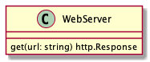
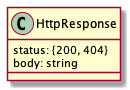

# 2019. december 10., kedd

[előző alkalom](../20191203) [következő alkalom](../20191212)

## Órai anyag

### Kivételkezelés

- [Vezérlési szerkezetek és hibakezelés (Exception handling statements rész)](https://developer.mozilla.org/en-US/docs/Web/JavaScript/Guide/Control_flow_and_error_handling) 
- [throw](https://developer.mozilla.org/en-US/docs/Web/JavaScript/Reference/Statements/throw)
- [try, catch, finally](https://developer.mozilla.org/en-US/docs/Web/JavaScript/Reference/Statements/try...catch)
- [JS Error referencia](https://developer.mozilla.org/en-US/docs/Web/JavaScript/Reference/Global_Objects/Error)
- [Node.js error doksi](https://nodejs.org/dist/latest-v12.x/docs/api/errors.html#errors_errors)


### Fájlkezelés (csak szinkronos)

- [Reading files with Node.js](https://nodejs.dev/reading-files-with-nodejs)
- [Writing files with Node.js](https://nodejs.dev/writing-files-with-nodejs)
- [Node.js fs modul doksi](https://nodejs.org/dist/latest-v12.x/docs/api/fs.html#fs_fs_readfilesync_path_options)

## Házi feladat

### Adatbázis

Írjuk egy egyszerű adatbázist!

A main modul egy paramétert vár, egy műveletet.

```
$ node main listStudents
```

A művelet alapján egy `database` modul megfelelő függvénye végrehajtódik és a fájlokban tárolt adatok alapján
visszaadja az eredményt.

```
// main.js
let database = require('database');
let result;
switch(process.argv[2]) {
    case 'listStudents':
        result = database.listStudents();
        console.log(result) // <-- ehelyett rendes, formázott kimenet
        break;
    // ...
}
console.log(result);
```

Írjuk meg az alábbi műveleteket!

1. listStudents: kiírja a hallgatók neveit
1. maxPoints: kiírja annak a hallgatónak a nevét, aki a legtöbb pontot szerezte a vizsgán
1. failedStudents: a megbukott hallgatók neveit írja ki

fájlstruktúra:
```
main.js
database.js
tables/
    students.json
    courses.json
    teachers.json
    exams.json
```

[students.json](./students.json)
```
[
    {
        "name": "Steve Strong",
         "id": 1
    },
    {
        "name": "Anna Sweet",
         "id": 2
    },  
    {
        "name": "Hairy Otter", 
        "id": 3
    },
    {
        "name": "Fermione Stranger",
         "id": 4
    },
    {
        "name": "Yevgeny Kissin",
         "id": 5
    },
    {
        "name": "Russian Sandra", 
        "id": 6
    },
    {
        "name": "Janicka Supernica", 
        "id": 7
    },
    {
        "name": "Clark Kent", 
        "id": 8
    }
]
```

[courses.json](./courses.json)
```
[
    {
        "name": "junior web developer",
        "students": [1, 2, 3, 4],
        "maxPoints": 100
    },
    {
        "name": "junior java developer",
        "students": [5, 6, 7, 8],
        "maxPoints": 100
    }
]
```

[teachers.json](./teachers.json)
```
[
    {
        "name" : "Paul Maurat",
        "id" : 1
    },
    {
        "name" : "Luke Kelly",
        "id" : 2
    }
]
```

[exams.json](./exams.json)
```
[
    {
        "courseId":1,
        "points":[
            {
                "studentId":1,
                "points": 70
            },
            {
                "studentId":2,
                "points": 98
            },
            {
                "studentId":3,
                "points": 76
            },
            {
                "studentId":4,
                "points": 63
            }
        ]
    },
    {
        "courseId":2,
        "points":[
            {
                "studentId":5,
                "points": 35
            },
            {
                "studentId":6,
                "points": 60
            },
            {
                "studentId":7,
                "points": 55
            },
            {
                "studentId":8,
                "points": 89
            }
        ]
    }
]
```


## Gyakorlatok

- Kivételkezelés
- Fájlkezelés
- Webszerver
- Adatbázis

### Webszerver

Modellezzünk egy webszerverrel történő kommunikációt! A webszerver egy objektum lesz, amelynek
egy metódusa egy URL string alapján felolvas egy fájlt és egy speciális objektummal tér vissza,
amely egy HTTP válaszüzenetet testesít meg.

A válaszüzenet HTTP státusza az alapján lesz 200 (OK) vagy 404 (NOT FOUND), hogy a webszerver
fel tudta-e olvasni (megtalálta-e) a fájlt, amit az URL testesít meg.

Felvezetés:
- HTTP alapok ismétlése: kliens, szerver, kérés, válasz, státusz kód
- Node.js url modul: https://nodejs.org/docs/latest-v12.x/api/url.html


Hozzuk létre az alábbi könyvtár struktúrát (a könyvtárakat / toldalék jelöli)

```
webserver/
    example.com/
        hello.html
    news.com/
        tech.html
    main.js
    webserver.js
```

Példa forgatönyv:

```
// main.js
let resp;

 // hello.html tartalmát adja vissza stringként
resp = webserver.get('http://example.com/hello.html')
if (resp.status === 200) {
    console.log(`success, status: ${resp.status}, response: ${resp.body}`)
}

 // nem létező oldal (az example.com alatt)
resp = webserver.get('http://example.com/tech.html')
if (resp.status !== 200) {
    console.log(`error, status: ${resp.status}, response: ${resp.body}`);
}

 // a news.com alatt már létező oldal
resp = webserver.get('http://news.com/tech.html')
if (resp.status === 200) {
    console.log(`success, status: ${resp.status}, response: ${resp.body}`)
}
```

#### A `WebServer` osztály



A `resp = webserver.get(url)` egy `HttpResponse` objektumot eredményez.



Az url string paraméter alapján egy fájlt akarunk felolvasni és annak tartalmát a HttpResponse objektumban a `body` propertyben visszatéríteni.

Az urlben a hoszt név (example.com) lesz a mappa neve, a hoszt név utáni rész a mappa alatti elérési útvonal (hello.html). Az URL többi része nem érdekes.

Ha az `url` alapján sikerült felolvasni a fájlt, `resp.status` értéke `200` és
`resp.body` a fájl tartalmát tartalmazza, máskülönben `resp.status` `404` lesz
és a `resp.body` üres.


A program indítása: `$ node main.js "http://example.com/hello.html"`

- egy parancssori argumentum, amely egy URL
- a program a parancssori argumentum alapján a hostname (`example.com`)
  által jelölt mappából a path rész által jelölt fájlt (minden, ami a
  hostname után jön, `hello.html`) felolvassa
- a felolvasott tartalmat kiírja

A kiírás a főprogramban történjen, az összes többi logika a `webserver` modulban.


Tippek:
1. kezdjük azzal, hogy a main modulból egy argumentumban kapott fájlt meg tudunk nyitni és a tartalmát kiírjuk. Írjuk meg a szükséges kivételkezelési kódot, arra az esetre, ha a fájl nem létezik!
1. alakítsuk át, hogy a WebServer osztály get metódusa csinálja a megnyitást és a kivételkezelést -- a get ekkor még egy fájl útvonalat kap, visszatérési értéke pedig egy string. Ha nem sikerült a fájl felolvasása, üres sztringet adjunk vissza. 
1. használjuk a Node.js url modulját arra, hogy fájl elérési útvonal helyett egy URLlel dolgozhassunk
1. egészítsük ki a kódot, hogy a HttpResponse osztályt használja az eredmény kommunikálására


