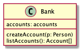
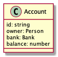
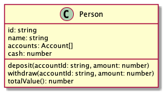

# 2019. december 17., kedd

[előző alkalom](../20191212) [következő alkalom](#)

## Órai anyag

- Mi az az `npm`?
- Node projekt inicializációja: `npm init`
- Mik azok a dependenciák?
- Dependenciák telepítése: `npm install`
- Globális vs. lokális telepítés
- Tájékozódás `npmjs.org` oldalon

---

- private propertyk jelzése _ prefixszel
- App és Configuration objektumok használata
- UUID generálása Node `uuid` modul használatával
- Plain object map, Map, tömb: mikor melyiket érdemes használni?

## Gyakorlat

### Banking

#### 01. feladat

  

#### 02. feladat

Mentsük el az adatokat a fájlrendszerre

#### 03. feladat

Készítsünk egy CLI interfészt a műveleteknek

reset subcommand törli az adatokat

#### 04. feladat

