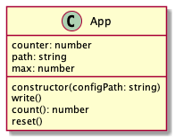

# 2019. december 17., kedd

[előző alkalom](../20191212) [következő alkalom](#)

# Órai anyag


- Mi az az `npm`?
- Node projekt inicializációja: `npm init`
- Mik azok a dependenciák?
- Dependenciák telepítése: `npm install`
- Csomagok globális vs. lokális telepítése
- Tájékozódás `npmjs.org` oldalon

---

- private propertyk jelzése _ prefixszel
  - konvenció vs. agyafúrt nyelvi megoldások closureökkel
- App és Configuration objektumok használata
  - Absztrakt segédosztályok a bonyolultság menedzselésére
- UUID generálása Node `uuid` modul használatával
  - "Garantáltan" egyedi azonosítók generálása külső könyvtárral
- Plain object map, Map, tömb: mikor melyiket érdemes használni?
  - plain object
    - egyszerű és nagyszerű (string, any) leképezések
    - konstans elérési és keresési idő
    - ismeretlen hossz
    - nincs sorrendezés
    - problémás iteráció: melyik property érdekes, melyik nem?
  - Map:
    - (object, any) leképezések
    - konstans elérési és keresési idő
    - ismeretlen hossz
    - nincs sorrendezés
  - Array
    - (integer, any) leképezések
    - konstans elérés, változó keresési idő
    - ismert hossz
    - sorrendezi az elemeket
    - triviális iteráció

# Gyakorlat

## Bemelegítés

Legyen warmup.js a főmodul. A programnak két működési módja van:
- count: felolvas egy számot egy fájlból, megnöveli eggyel, majd visszaírja a fájlba, illetve kiírja a kimenetre
- reset: lenullázza a számláló értékét

```
$ node warmup.js count
0
$ node warmup.js count
1
$ node warmup.js count
2
```

```
$ node warmup.js reset
Counter reset!
```

```
$ node warmup.js count
0
$ node warmup.js count
1
...
$ node warmup.js count
10
$ node warmup.js count
Counter maximum reached!
```

Legyen egy App osztály és app egy App objektum. Az App osztály metódusai hívódnak annak megfelelően, hogy a programot a count vagy a reset argumentummal indítottuk.



Legyen egy `config.json` fájl, benne egy `{"path": "counter.txt", "max": 10}` szerkezetű objektum literállal.

A path a counter értékét tároló fájl, a max a maximális counter érték.

Az app.constructor felolvassa a config.json fájlt és a benne tárolt adatokkal inicializálja az App objektumot. A path kulcson megadott fájlt is felolvassa, hogy be tudja állítani a counter értékét. Ha a fájl nem létezik, a program hibaüzenetben jelzi ezt és kilép.

---

## Banking

## 01. feladat

### Bank

Legyen egy Bank osztály és bank egy Bank objektum. 


 

#### bank._accounts

A bank objektum által létrehozott Account objektumok. Egyszerű objektumot használunk a leképezéshez. 

---

#### bank.constructor()

A bank.constructor beállít egy üres kezdőértéket a bank._accounts propertynek.

#### bank.createAccount(person)

A bank.createAccount létrehoz egy új bankszámlát és hozzárendeli azt a person paraméterben érkező Person objektumhoz. Visszatérési értéke a bankszámla futásidőben generált azonosítója, egy UUID alakú string.

#### bank.listAccounts()

A bank.listAccounts a banknál vezetett számlákat adja vissza egy tömbben.

#### bank.getAccountById(id)

A bank.getById az id paraméterben érkező UUID string által azonosított bankszámlát adja vissza.

---

### Account 

Legyen Account egy osztály és account egy Account objektum.


#### account._id

A bankszámla azonosítója. UUID string.

#### account._owner

A bankszámla tulajdonosa. Person objektum.

#### account._balance

A bankszámla egyenlege.

---

#### account.constructor(id, owner)

Az account.constructor beállítja a számla tulajdonosát. Az id paraméter egy UUID alakú string, a számla egyedi azonosítója.

#### account.deposit(person, amount)

Az account.deposit segítségével a bankszámla tulajdonosa pénz helyezhet el a folyószámlán. Visszatérési értéke a művelet sikerességét jelző bool érték. A betét sikeres, ha azt a számla tulajdonosa hajtja végre és van elegendő készpénze.

#### account.withdraw(person, amount)

A account.withdraw segítségével a bankszámla tulajdonosa pénzt vehet fel a folyószámláról. Visszatérési értéke a kivét sikerességét jelző bool érték. A művelet sikeres, ha a person a számla tulajdonosa és volt elegendő egyenleg.

---

### Person


#### person._name

A személy neve.

#### person._cash

A személy készpénze.

#### constructor(name, cash)

Inicializál egy személyt. A név a name, a készpénz a cash paraméterben érkezik. Kezdetben egyetlen személynek sincs bankszámlája.

#### person.assetSum()

A person.assetSum összegzi a személy összes bankszámlájának egyenlegét és a készpénzét és visszatér az értékkel

---

#### 02. feladat

Egészítsük ki a Person osztályt egy collect metódussal.

#### collect(amount): bool

A person.collect "begyűjti" az amount paraméterben megadott összeget a bankszámlákról. Ha az első vizsgált bankszámlán elegendő az egyenleg, a metódus visszatér, különben a következő folyószámláról megpróbálja kivenni a fennmaradó összeget és így tovább. Ha sikerült összegyűjteni a mondott összeget, akkor és csak akkor, a művelet sikeres. Ha sikertelen a művelet, akkor sem az egyenlegek sem a személy készpénz értéke nem változik!

---

#### 03. feladat

Legyen egy App egy alkalkazást leíró osztály és app egy App objektum. Írjunk metódusokat a program állapotának fájlrendszerre mentésére és visszaolvasására!


#### app.constructor()

Inicializálja az App objektumot egy üres app._banks és app._persons tömbbel.

#### app.restore(dataDir)

Felolvassa a dataDir paraméterben megadott mappában található fájlokat és a tartalmuk alapján inicializálja az app._banks és app._persons propertyket.

#### app.persist(dataDir)

Elmenti a alkalmazás aktuális állapotát a megfelelő fájlokba az dataDir mappában.

---

#### 04. feladat

Készítsünk egy CLI interfészt az alábbi alparancsokkal

- person
  - create: személy létrehozása
- bank
  - create: bank létrehozása
- account
  - create: bankszámla létrehozása
  - deposit: pénz elhelyezése bankszámlán

Az alparancsok paraméterei -- prefixszel vannak jelölve és egy az egyben a meghívandó metódusok paramétereire képeződnek le.

`$ node banking.js person create --name="Steve Strong" --cash=100`


`$ node banking.js bank create --name="ABC"`

`$ node banking.js account create --person="Steve Strong" --bank="ABC"`

`$ node banking.js account deposit --person="Steve Strong" --amount  --bank="ABC"`


