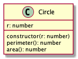

# Rectangle

Írjunk egy `Circle` osztályt, amely egy kört reprezentál.

## constructor(r: number)

Inicializálja a kört a sugarával. Hibakezeléstől, alapértékektől eltekintünk.

## perimeter(): number

A kör kerületét adja vissza egész számra kerektíve lefelé.

## area(): number

A kör területét adja vissza egész számra kerekítve lefelé.