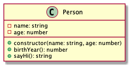

# Person

Tekintsük az alábbi, személyt leíró `Person` osztályt.

A `name` és `age` private propertyk a személy neve és életkora.

## constructor(name: string, age: number)

Inicializálj az objektumot. Hibakezeléstől, alapértékektől eltekintünk.

## birthYear(): number

A személy születési évével tér vissza. A születési év a mai dátum éve alapján számolódik.

## sayHi(): string

Egy rövid bemutatkozó szöveggel tér vissza.

Minta: `"Hi, my name is John Doe and I'm 33 years old and my hobbies are coding, reading."`

